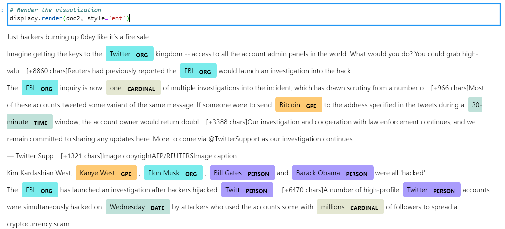

# Unit12_NLP
## Sentiment Analysis
-  All latest Bitcoin and Ethereum latest news are pulled from NewsApi. After putting all articles into a pandas dataframe, I used the function SentimentIntensityAnalyzer that is coming from NLTK sentiment vader library for sentiment analysis.

- Articles sentiments are categorized into four sections: "Compound", "Positive", "Neutral", and "Negative". By comparing the two coins, ethereum has the highest mean positive score (0.102); bitcoin has the highest negative score (0.277); ethereum has the highest positive score (0.226).

## Natural Language Processing
  - I defined a function: tokenizer; I used the function along with the nltk libtary to tokenize the text for each coin. After tokenizing the text, all words are lowercased; punctuations are removed, and stop words are removed. 

  - Then I defined another function: processtext, so that each individual articles can be processed for producing word counts and ngrams. 

  - After producing word counts, we can see for example, the most common words used in the second bitcoin article are fbi and investigation, which I'm assuming is related to the recent twitter hack event. 

  - Word Cloud is also created to visualize the common words used in an article

  ## Named Entity Recognition
   - In the last section, all article texts for each coin are put together for building a NER model. By using the SpaCy library, NER for each coin is highlighted in the text for better visualization. 
   - Since the color highlights are not shown in the workbook, I've provided a sample in the following:
   